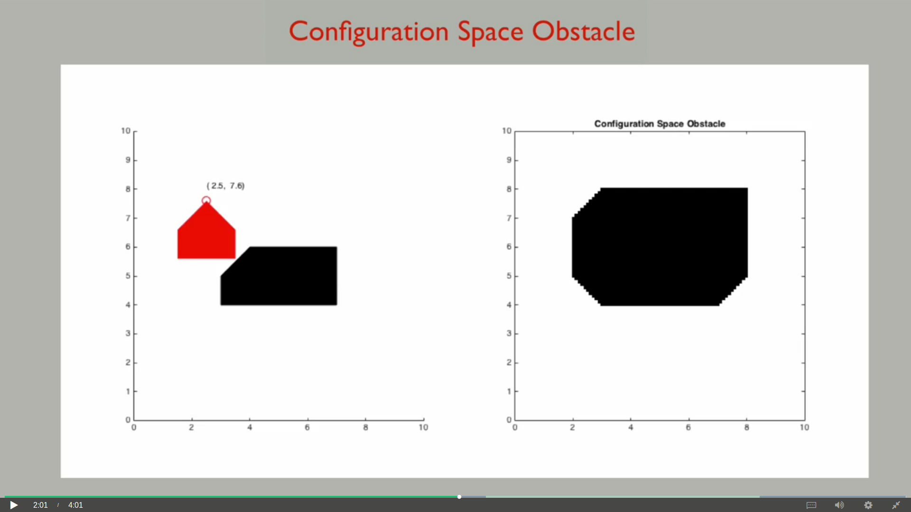

# Path Planning

## Configuration Space 

It is the steerable space of the robot. The above figures show the tx, ty configurations that the robot cannot attain because of the obstacle. The dimensions and shape of the configuration space obstacle are obtained by considering both the obstacle and the shape of the robot. The configuration space obstacle is defined by what's known as the Minkowski sum of the obstacle and the robot shape. The configuration of the robot corresponds to a point in the configuration space and the dark areas correspond to configurations that the robot cannot attain.

## Path Planning Algorithms

This section contains links to brief explanations of the various algorithms used for path planning:













