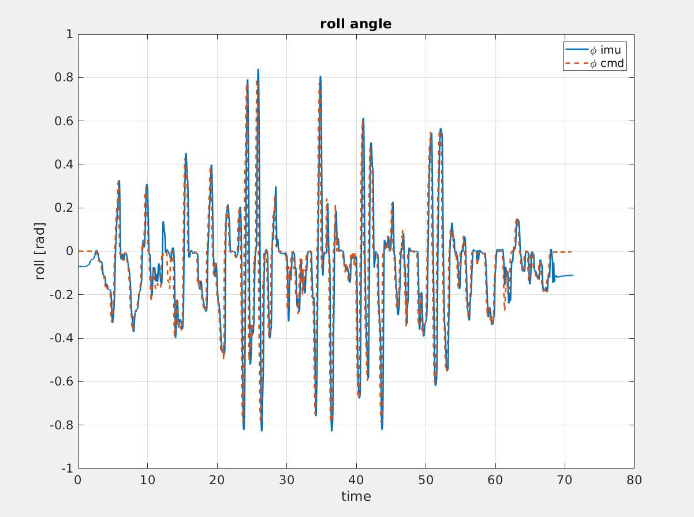

# System Identification

## Data collection

We will need to record the commanded system attitude and the estimated attitude. When using mav\_control\_rw and PX4 this is done as follows.

* Use one of the provided example launchfiles to start mavros and mav\_nonlinear\_mpc



* On the RC remote put the system into offboard mode. This will put the mpc infrastructure in the loop making any commanded attitude sent to the system visable to ROS on the topic `mavros/setpoint_raw/roll_pitch_yawrate_thrust`.
* Put the MPC into RC teleop mode \(usually done through the RC remote\). This is done as we can't use the MPC before the sysid is done \(and also lets us fly without a position estimate\). In this mode the MPC just scales and passes through RC stick commands.
* Record the commanded attitude as well as the PX4 estimated attitude \(`mavros/setpoint_raw/roll_pitch_yawrate_thrust` and `mavros/imu/data`


they may be in a namespace


Fly the system for a few minutes recording the data, try to fly a range of roll and pitches so that all normal flight characteristics can be observed. Yaw is not explicitly modeled in the MPC so does not need identification in the same way.


## Data Processing

We use the a standard Matlab toolbox for model fitting. This is done by the [mav\_sysid.m](https://github.com/ethz-asl/mav_system_identification/blob/master/mav_sysid/mav_sysid.m) in our [mav\_system\_identification repo](https://github.com/ethz-asl/mav_system_identification).

Once run it should produce a series of graphs as well as a print out of the needed parameters. An example of the roll response is shown below.



and an example of the script output is as follows

```text
=====================================================================
1st order dynamics
pitch fit percentage: 85.524922%
roll fit percentage: 86.501898%

---------------------------------------------------------------------
Copy the following into your nonlinear_mpc.yaml file
---------------------------------------------------------------------
# Controller Parameters:
mass: 2.500000
roll_time_constant: 0.141111
roll_gain: 1.037908
pitch_time_constant: 0.138129
pitch_gain: 1.035411
linear_drag_coefficients: [0.020000, 0.020000, 0.000000]
yaw_gain: 1.000000
---------------------------------------------------------------------
=====================================================================
2nd order dynamics
pitch fit percentage: 89.155261%
roll fit percentage: 91.344527%

---------------------------------------------------------------------
Copy the following into your disturbance_observer.yaml file
---------------------------------------------------------------------
  #model from system identification (2nd order attitude model)
  drag_coefficients: [0.020000, 0.020000, 0.000000]
  roll_gain: 0.964957
  roll_damping: 0.672272
  roll_omega: 10.540684
  pitch_gain: 0.970397
  pitch_damping: 0.648367
  pitch_omega: 10.177723
  yaw_gain: 1.000000
  yaw_damping: 0.950000
  yaw_omega: 5.000000
---------------------------------------------------------------------
=====================================================================
pixhawk thrust settings
---------------------------------------------------------------------
Copy the following into your px4_config.yaml file
---------------------------------------------------------------------
# setpoint_raw
setpoint_raw:
  thrust_scaling_factor: 0.010384
  system_mass_kg: 2.500000
  yaw_rate_scaling_factor: 1.000000
---------------------------------------------------------------------
```

The estimated response should closely match the actual. As a rule of thumb if the given fit percentage isn't at least 70% something has gone wrong. If everything looks good just copy the given parameters to the specified files, overwriting the old values.

## High level MPC tuning

[mav\_control\_rw](https://github.com/ethz-asl/mav_control_rw) loads the MPC default values from the `nonlinear_mpc.yaml` file and the default disturbance observer values from the `disturbance_observer.yaml` file. Note that the MPC outputs a desired thrust in Newtons, to send this to the PX4 it must first be converted to the range 0 to 1. This is done in mavros using the thrust\_scaling\_factor given in `px4_config.yaml`.

The best values for the MPC and disturbance observer will depend a lot on your system and your goal \(for example finding the balance between twitchiness and position holding\). Because of this the system is best tuned by putting the system into position hold mode, starting rqt and tweaking the parameters while giving new position commands. It is usually easiest to start by disabling the disturbance observer \(uncheck offset free\) and integrator when tuning so the effects of the different parts are not mixed together. A word of warning, if your thrust constant is wrong by a very large amount your system will power into the ceiling as soon as you enable the MPC.

